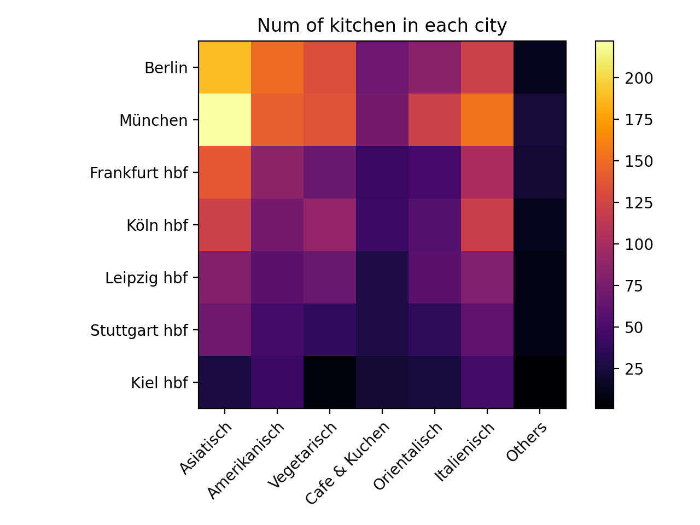

# LetsScrape
## 1. Overview 


 This is our final project for the course "Scientific Programming in Python" of the University Osnabrück. Our goal is to compare the range of restaurants in different german cities
 available on Lieferando (www.lieferando.de). To gather the data we use Selenium (https://selenium-python.readthedocs.io) and matplotlib (https://matplotlib.org) 
 to visualise the results. 

 ## 2. Installation 
 ### General requirements
 <ul>
 <li>Working python enviroment with version >= python 3.7 (https://www.python.org) </li> <br>
 <li>Or working Conda environment with python version >= 3.7 <a href="https://docs.conda.io/projects/conda/en/latest/user-guide/install/index.html">(Install Conda)</a> </li><br> 
 <li>Chromedriver (https://chromedriver.chromium.org/downloads)<br> Install the chromdriver which fits your brower version. You can see the chrome version under Settings>About Chrome. </li> <br>
 </ul>

 ### Installation process
 Open a terminal in the project folder and enter <br>

     $ pip install -r requirements.txt

  You need to change the PATH in [`scraper.py`](./scraper.py) in <b>line 17 and 18</b> depending on your operating system. 

  #### For Mac
  Attention: You might need to give special permissions to your chromedriver to work: <br>
 
  ```Python 
 PATH = "PATH TO YOUR DRIVER"  
 driver = webdriver.Chrome(PATH)  
  
  ```
  #### For Windows 
  ```Python 
 PATH = "PATH TO YOUR DRIVER"  
 driver = webdriver.Chrome(executable_path=PATH)  
  
  ```
  #### For Ubuntu Linux 
  

  ## 3. How to use the program
  Run lets_scrape.py 

     $ python lets_scrape.py

  and then follow the dialoge. As a result there should appear up to two pdf files in LetsScrape/Output.

  ### Troubleshooting and Remarks


   #### Entering adresses <br>
   <ul><li>Lieferando might not find the city. You may use an actual adress or add " Hbf" to the city name if the city has a central station or you can add the zip code to the city name.</li> <br>
   <li>For cities which might occur multiple times in germany, you may enter the zip code to the city name. </li></ul>
   
   ##Motivation and Decision making
   
   Since we are students, we most likely make up a big part of Lieferando's (and other delivery services') customers
   and wanted to have an option to compare different citys and their offers in terms of diversity, delivery costs, delivery time etc.
   
   ## 4. Motivation, Goal and Result
   
   ### Motivation
   Early on we agreed to use Webscraping and Matplotlib for the project. Since we are students, we most likely make up a big part of Lieferando's (and other delivery services') customers and we noticed that the Lieferando offer in Osnabrück is quite homogeneous. Mostly pizza and burger. We agreed to scrape information on Lieferando.de to compare Osnabrück with other german cities. <br>
   
   ### Goal
   Our goal is to compare differnt locations in Germany in terms of diversity, delivery costs, delivery time, ratings etc. and to visualise the results in a convincing and informative way. <br>
   
   ### Result and Progress
   
   #### Kitchen Categories
   
    As development moved on we realised that Lieferando.de has a quite liberal policy for restaurants to choose their kitchens. As an exsample a restaurant can have the kitchens "Italienisch, Italienische Pizza, Pasta" which all can be categorized as Italian. So we decided to make our own categories to reduce the number of kitchens, but of course it is still possible to apply the kitchens on Lieferando.de. <br>
   
   
   
   As you can see there might be plenty of kitchens and some types of kitchens are rare and not representive (black squares). So we decided to sort those small sub-kitchens into broader kitchens.
   <ul>
    <li><b>Asiatisch</b>: Sushi, Japanisch, Poke bowl, Indisch, Thailändisch, Curry, Vietnamesisch, Chinesisch, Koreanisch, Dumplings, Indonesisch, Pakistanisch</li>
    <li><b>Orientalisch</b>: Türkisch, Döner, Falafel, 100% Halal, Persisch, Türkische Pizza, Arabisch, Syrisch, Libanesisch, Gyros, Griechisch, Balkanküche</li>
    <li><b>Italienisch</b>: Italienische Pizza, Pasta</li>
    <li><b>Amerikanisch</b>: Amerikanisch, Burger, Amerikanische Pizza, Hot Dog, Sandwiches, Mexikanisch, Argentinisch, Spareribs</li>
    <li><b>Vegetarisch</b>: Vegan</li>
    <li><b>Cafe & Kuchen</b>: Eiscreme, Snacks, Kuchen, Nachspeisen, Backwaren, Café, Frühstück
   </ul>
   This is how the heatmap looks like if one applies our categorization:
   
   
   
   #### Plots 
   We decided to use several Plots to compare cities and to show the information of interest. One can distinguish the types of plots in three categories. 
   ##### One City
   <ul>
    <li><b>Pie Plot:</b> Illustrates the number of kitchens in the city. We recommand you to use our custom kitchen categories, but we also included a feature that rare kitchens will be collected in 'Others'. Yet it might be more clean if one uses the custom kitchen and 'others' will be smaller.</li>
    <li><b>Bar Plot:</b> Illustrates the number of kitchens or the average of delivery time, delivery cost, minimum order cost or ratings. Both the custom and Lieferando's kitchen work fine.</li>
    </ul>
   ##### Two Cities
   <ul>
    <li><b>Bar Plot for Differences:</b> Illustrates the differences of two cities of the number of kitchens or the average of delivery time, delivery cost, minimum order cost or ratings between both cities. Here again bar plots can handle a lot of kitchens quite well, so both the custom and Lieferando's kitchens are fine.</li>
   </ul>
   ##### Multiple Cities above two
   <ul>
 <li><b>3D Plot with multiple bars:</b> Illustrates the number of kitchens of multiple cities. We recommend to use the custom kitchens, because for cities it will be to messy otherwise. In general we recommend the heatmap over this plot. This plot is intended as a cover sheet picture, but it can still provide a nice overview. </li>
 <li><b>Heatmap:</b> Illustrates the number of kitchens or the average of delivery time, delivery cost, minimum order cost or ratings of multiple cities in a heatmap. It looks better with the custom kitchen tags as you can see above. </li>
 </ul>
 
 For how the plots look like and how to interpret them, we would refer you to the Juypter-Notebook.
 
   
     
  
   
 ## 5. Structure 
 We structured our program in five python files. 
 <ul>
  <li>scraper.py       - Scrape the information of interest of lieferando.de </li>
  <li>lets_scrape.py   - User Interface </li>
  <li>ui_helper.py     - Helper functions for the User Interface </li>
  <li>visualization.py - Compute the plots using Matplotlib</li>
  <li>data_helper      - Helper functions to formate and change data
 </ul>
   
   
   
   
   
   


